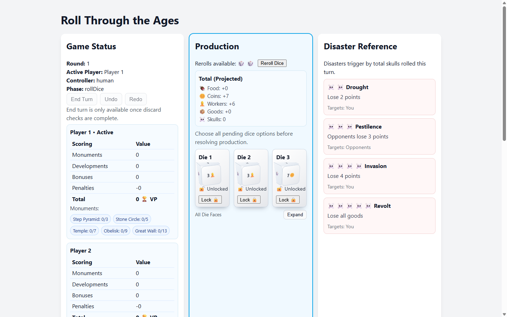

# Roll Through the Ages (Web)

A browser-based, client-only implementation of **Roll Through the Ages**, built with React + TypeScript + Redux.

This repo includes:
- A rules engine (`src/game/engine`) for production, disasters, build/development, discard, scoring
- A playable UI (`src/App.tsx` + components)
- Bot players (heuristic + lookahead)
- Headless automation scripts for bot evaluation/tournaments/beam search

## Live Demo

- GitHub Pages: https://ggulati.github.io/RollThroughAges/



## Tech Stack

- React 19
- TypeScript
- Redux Toolkit
- Vite
- Vitest + Testing Library
- ESLint + Prettier
- Playwright CLI (manual smoke/e2e checks)

## Project Layout

- `src/game/`: game types, definitions, and shared game logic
- `src/game/engine/`: pure engine modules (`*Engine.ts`)
- `src/game/bot/`: bot implementations and shared bot infrastructure
- `src/game/automation/`: headless game/evaluation helpers
- `src/store/`: Redux slice + selectors
- `src/__tests__/`: engine/store/integration/bot tests
- `scripts/`: bot eval/tournament/beam-search scripts
- `planning/`: staged implementation docs and plans
- `output/`: generated artifacts (bot evals, tournaments, Playwright captures)

## Prerequisites

- Node.js 20+
- npm 10+

## Quick Start

```bash
npm install
npm run dev
```

Open the local URL Vite prints (typically `http://127.0.0.1:5173`).

## Core Commands

```bash
npm run dev            # Start dev server
npm run build          # Production build (dist/)
npm run preview        # Preview build
npm run typecheck      # TypeScript checks
npm run lint           # ESLint
npm run lint:strict    # ESLint with zero warnings allowed
npm run format         # Prettier check
npm run format:fix     # Prettier write
npm test               # Vitest run once
npm run test:watch     # Vitest watch mode
```

## Bot Automation Scripts

Use `tsx` to run scripts in `scripts/`.

Examples:

```bash
npx tsx scripts/bot_evals.ts --help
npx tsx scripts/bot_tournament.ts --help
npx tsx scripts/bot_beam_search.ts --help
```

These scripts write result artifacts to `output/`.

## Using AI Agents in This Repo

This repository is configured for AI-assisted coding with `AGENTS.md`

Planning docs in `planning/` are the source of truth when behavior conflicts arise.
